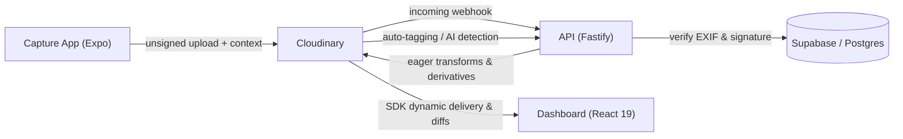
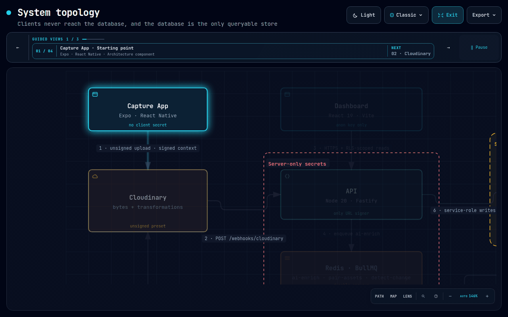
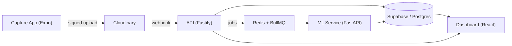
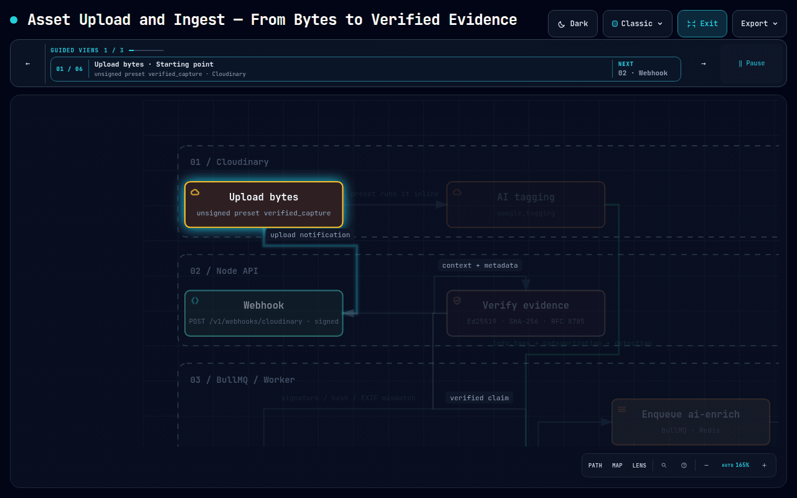
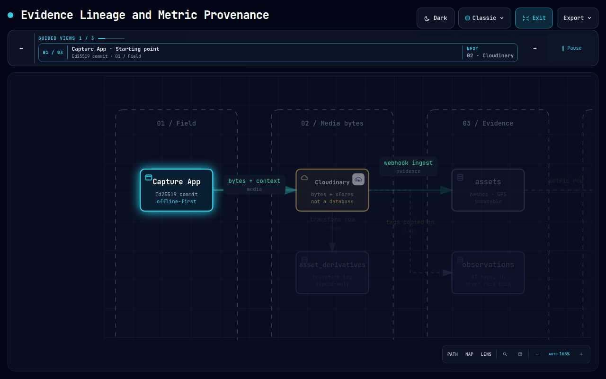

<p align="center">
  <a href="https://panchnama-ka-1205.vercel.app"></a>
</p>

<h1 align="center"></h1>

<p align="center"><i>पंचनामा — a written record of inspection, signed by a witness.</i></p>

<p align="center"><b>Turn raw field photos and videos into searchable evidence, quantified impact metrics, and audit-ready reports.</b></p>

<p align="center">
  <a href="LICENSE.txt"></a>
  <a href="https://panchnama-ka-1205.vercel.app"></a>
  <a href="https://drive.google.com/drive/folders/1Z2X8ua0fywWcQw9VTVyCJyeQLQK_arGV?usp=sharing"></a>
  
  
  
</p>

<p align="center">
  <a href="#-hackathon-track">Track</a> ·
  <a href="#-the-problem">Problem</a> ·
  <a href="#-how-we-used-cloudinary">Cloudinary</a> ·
  <a href="#-key-features">Features</a> ·
  <a href="#-tech-stack">Tech stack</a> ·
  <a href="#-project-structure">Project structure</a> ·
  <a href="#-configuration-and-ml-routing">Configuration</a> ·
  <a href="#-how-it-works">How it works</a> ·
  <a href="#-capture-app">Capture app</a> ·
  <a href="#-architecture--system-diagrams">Architecture</a> ·
  <a href="#-how-to-test-it">How to test</a> ·
  <a href="#-documentation">Docs</a>
</p>

---

> [!NOTE]
> Panchnama is built for **NGOs, governments, and sustainability organisations** that collect huge volumes of field media but cannot organise, verify, or report on it. It is an **evidence and measurement system**, not a DAM or a stock library. Media is stored on Cloudinary, but the product is the proof around it.

---

## 🏆 Hackathon Track

**Panchnama** is submitted for **HackIndia 2026** under the **Cloudinary Media Intelligence & Analytics Track**.

Panchnama integrates Cloudinary as its core media infrastructure and processing engine, pairing direct authenticated uploads with dynamic SDK transformations, auto-tagging, keyframe extraction, and generative AI derivatives—all bound to an immutable cryptographic hash chain in Postgres.

---

## 🔍 The problem

An NGO uploads 40,000 field photos from a six-month reforestation programme. Three months later a donor asks for evidence that 800 hectares were restored. What exists is a phone gallery: nobody can find the northern plots, nobody can prove the "after" photos were taken on the same ground as the "before" photos, and a hand-counted sapling number is impossible to audit.

| Failure | Consequence |
| --- | --- |
| **Media is not evidence.** Edited, re-compressed, or re-captioned with no tamper signal | Every number built on it is disputable; reports get rejected |
| **Impact is unquantified.** "Look, trees!" | Donors fund outcomes, not photographs; counting is manual and unverifiable |
| **Nothing is traceable.** A figure cannot be traced to a photo, model, or version | A report cannot be defended under audit |

Panchnama closes all three: capture is **signed at the moment of the shutter**, change is **measured by a versioned model**, and every report carries a **hash chain** tying a number to a photograph, a model version, and a timestamp.

<details open>
<summary><b>How Panchnama compares to a typical platform</b></summary>

<br>

| Typical platforms | Panchnama |
| --- | --- |
| Upload portal + AI tags | **Tamper-proof capture** + cryptographic proof |
| Manual before/after slider | **Auto GPS clustering** + quantified metrics (hectares, counts) |
| Searchable gallery | **Semantic search** + GPS accuracy and observation-type filters |
| Manual report compilation | **Template-based PDF** + video clips + integrity appendix |
| Trust-based evidence | **Audit-ready**: hash chain, signatures, dual timestamps, EXIF freeze |

</details>

---

## ☁️ How We Used Cloudinary

Cloudinary is the **system of record for bytes and transformations** across the Panchnama pipeline.



### 1. Direct Upload & Cryptographic Context
- Field workers capture photos or 30 s video clips on the mobile app.
- The app computes a raw SHA-256 hash, canonicalizes EXIF (RFC 8785), and signs the payload using an Ed25519 hardware key (Secure Enclave / Keystore).
- Uploads hit Cloudinary directly using an unsigned upload preset (`verified_capture`) with `type: authenticated` and `overwrite: false`.
- Integrity claims (signature, GPS, EXIF hash, device clock, NTP skew) are stored in Cloudinary's `context` metadata.

### 2. Original vs. Derivative Asset Architecture
- **Immutable Originals (`authenticated`)**: Raw evidence photos and videos are stored in Cloudinary `authenticated` mode. Original media is write-once and protected by Postgres `BEFORE DELETE` triggers.
- **Signed Derivatives (`upload`)**: Transformations (resizing, cropping, formatting, keyframe posters) and generative edits create distinct rows in `asset_derivatives` linked to the parent asset.

### 3. Dynamic SDK URL Generation & Transformations
- All frontend media URLs are dynamically built using `@cloudinary/url-gen` and the Cloudinary React SDK (`@cloudinary/react`).
- Strict parameters adhere to Cloudinary specifications:
  - Responsive delivery: `f_auto`, `q_auto`, `c_limit,w_1920`
  - Keyframe extraction for video: `so_0`, `eo_30`, `du_30`
  - Signed private delivery using Node SDK v2 (`cloudinary.url(...)` with short-lived `auth_token`).

### 4. Cloudinary AI Tagging & Categorization
- Incoming media triggers Cloudinary **Google Tagging** and **OpenImages Categorization**.
- Webhook notifications copy tags into Postgres `observations` under Row-Level Security (RLS) for fast full-text multi-facet search.

### 5. Generative AI on Report Derivatives
- Cloudinary Generative Fill (`b_gen_fill`), Remove (`e_gen_remove`), Recolor, and Restore run **exclusively on report derivative assets** (`is_generative = true`).

> [!IMPORTANT]
> Generative AI runs **only on derivative report copies**, never on source evidence. Originals keep their SHA-256, EXIF hash, and audit chain intact.

### 6. Media Reconciliation Worker
- A background worker recomputes organization storage usage and detects missing or orphaned assets by cross-referencing Cloudinary storage with Postgres metadata.

---

## ✨ Key features

| Feature | What it does |
| --- | --- |
| **Tamper-proof capture** | Mobile app creates immutable, git-like commits: SHA-256 file hash, Ed25519 device signature (Secure Enclave / Keystore), frozen EXIF, GPS accuracy, and dual timestamps |
| **Multi-sector intelligence** | One project can hold several observation types (e.g. water cleanup, road construction, mangrove planting), each with its own ML model, GPS clustering radius, and metrics schema |
| **AI change detection** | Per-type GPS pairing, then ML routing, then quantified metrics (hectares, counts, % change) plus visual diff overlays |
| **Video support (MVP)** | 30-second clips, auto thumbnails, keyframe extraction, keyframe-based change detection, synchronized diff player |
| **Audit-ready reports** | Template-based PDF/HTML with an integrity appendix (hash chain, signatures, timestamps, GPS accuracy); verification target is under 5 minutes |
| **Full traceability** | SHA-256 hash chain in audit logs, EXIF hash verification, caption signatures, GPS accuracy recording |

---

## 🧰 Tech stack

| Layer | Technology | Purpose |
| --- | --- | --- |
| **Capture app** | Expo, React Native, `expo-camera`, `expo-location`, `expo-secure-store` | Capture evidence, record GPS, sign and sync commits |
| **Media platform** | Cloudinary | Secure uploads, transformations, AI tagging, video processing |
| **Database and auth** | Supabase, PostgreSQL, PostGIS, Row-Level Security | Store evidence metadata, enforce tenant isolation, and authenticate users |
| **API** | Node.js 20, Fastify, TypeScript, BullMQ | REST API, webhooks, verification, and background jobs |
| **ML service** | Python 3.11, FastAPI, PyTorch, YOLOv8, ChangeFormer | Sector-specific detection and before/after analysis |
| **Dashboard** | React 19, Vite, TanStack Query, MapLibre GL | Evidence search, maps, integrity review, and reports |
| **Workspace** | pnpm, Turborepo, TypeScript | Manage and build the monorepo |

<p>
  
  
  
  
  
  
  
  
  
  
  
  
  
  
</p>

## 📁 Project structure

```text
panchnama/
├── apps/
│   ├── api/              # Node.js · Fastify · TypeScript · BullMQ
│   ├── capture-app/      # Expo · React Native · camera · GPS · signing
│   ├── dashboard/        # React · Vite · TanStack Query · MapLibre
│   └── ml-service/       # Python · FastAPI · PyTorch · CV models
├── packages/
│   ├── shared/           # Shared types, Zod schemas, canonicalization, signing
│   └── ui-components/    # Shared React UI components
├── docs/
│   ├── architecture/     # System, API, database, and Cloudinary documentation
│   └── assets/           # Architecture diagrams and illustrations
├── scripts/              # Repository and demo-data utilities
├── supabase/
│   ├── migrations/       # Numbered database migrations
│   └── tests/            # pgTAP database tests
├── pnpm-workspace.yaml
└── turbo.json            # Monorepo task pipeline
```

## ⚙️ Configuration and ML routing

Each project stores its observation types and model routing in `projects.config`. Every observation type requires a `type`, a `model` key from `model_registry`, and a numeric `gps_radius` (meters). `label` and `phase_field` are optional.

```json
{
  "observation_types": [
    {
      "type": "mangrove_planting",
      "label": "Mangrove Planting",
      "model": "forestry",
      "gps_radius": 5,
      "phase_field": "planting_phase"
    },
    {
      "type": "water_extent",
      "label": "Water Cleanup",
      "model": "water",
      "gps_radius": 10
    }
  ],
  "report_template": "default"
}
```

The API and database validate the project config. ML models resolve by their registered key and version; an untrained or unsupported model returns `unsupported` rather than falling back to another sector's model. See [model routing and schema details](docs/architecture/DATABASE_SCHEMA.md#model-registry) and the [ML service environment example](apps/ml-service/.env.example).

| Model key | Registry status |
| --- | --- |
| `forestry` | `trained` (`v1.0`) |
| `water` | `trained` (`v1.0`) |
| `infrastructure` | `unsupported` |
| `agriculture` | `unsupported` |

Configure local services using the relevant environment examples: [API](apps/api/.env.example), [capture app](apps/capture-app/.env.example), and [ML service](apps/ml-service/.env.example). Keep secrets server-side; only documented public configuration belongs in client app environment variables. See [ENVIRONMENT.md](ENVIRONMENT.md).

---

## 📲 Capture app

Download the Panchnama capture app from the [Google Drive folder](https://drive.google.com/drive/folders/1Z2X8ua0fywWcQw9VTVyCJyeQLQK_arGV?usp=sharing).

---

## 🧠 How it works

<p align="center">
  
</p>



1. **Capture:** the field worker picks project, observation type, and phase, then captures a photo or video (30 s max). The app freezes EXIF, records GPS and accuracy, and signs the commit with the device key.
2. **Upload:** straight to Cloudinary with the integrity claims (signature, GPS, caption signature, EXIF hash) in the `context` field.
3. **Ingest and verify:** a Cloudinary webhook hits the API, which independently re-verifies the signature, re-hashes the bytes, and re-canonicalizes EXIF (RFC 8785). The result is `pass`, `fail`, or `unknown`.
4. **AI enrichment:** the API queues an `ai-enrich` job; the ML service runs the sector model, and Cloudinary tagging output is copied into Postgres.
5. **Pairing:** a BullMQ `pair-assets` job runs every 5 minutes, clustering unpaired before/after assets per observation type by GPS radius and time.
6. **Change detection:** the ML service returns quantified metrics and a red-overlay diff image, with the `model_version` recorded. Sectors without a trained model return `unsupported`.
7. **Reports:** Handlebars + Puppeteer produce a self-contained artifact with a `sha256` manifest, so a finalized report renders offline forever.
8. **Delivery:** the dashboard shows change events, a diff slider, a map, and integrity cards. Original media needs a 5-minute auth token.

---

## 📐 Architecture & System Diagrams

The platform's architecture, field capture pipelines, evidence verification, and cryptographic hash chain are fully mapped out below.

<details open>
<summary><b>1. System Topology</b></summary>

<br>

High-level architecture showing client boundaries, Cloudinary media ingestion, API service workers, ML inference routing, and Supabase RLS isolation.


</details>

<details>
<summary><b>2. Field Capture & Offline Sync ("The Capture Act")</b></summary>

<br>

On-device evidence collection pipeline: camera capture, EXIF freezing, SHA-256 commit hashing, Ed25519 hardware key signing (Secure Enclave / Keystore), MMKV local persistence, and background sync retry logic.


</details>

<details>
<summary><b>3. Asset Upload & Ingest Pipeline</b></summary>

<br>

Direct unsigned media upload to Cloudinary with signed `context` payload, Fastify webhook ingestion, signature re-verification, and BullMQ worker job dispatch.



</details>

<details>
<summary><b>4. Evidence Ingest Verification Sequence</b></summary>

<br>

Step-by-step sequence diagram covering direct upload, webhook notification, server-side RFC 8785 EXIF verification, cryptographic validation, and database state updates.


</details>

<details>
<summary><b>5. Evidence Lineage & Cryptographic Hash Chain</b></summary>

<br>

Immutability model tracking raw evidence assets to AI derivatives, audit log SHA-256 chain recalculation, and tamper-detection safeguards.



</details>

<details>
<summary><b>6. Asset Lifecycle States</b></summary>

<br>

State machine detailing transition rules for assets across capture, ingestion, verification (`pass`, `fail`, `unknown`), AI pairing, change detection, and audit report generation.


</details>

---

## 🧪 How to test it

Follow these step-by-step instructions to set up and test Panchnama locally.

### Prerequisites

| Tool | Version |
| --- | --- |
| Node.js | 20.x |
| pnpm | 10.x |
| Python | 3.11 |
| Docker | latest |
| Supabase CLI | 2.x |

---

### 1. Clone and install

```bash
git clone https://github.com/KA-1205/Panchnama.git
cd Panchnama
pnpm install
```

---

### 2. Create local env files

```bash
for app in api ml-service capture-app dashboard; do
  cp apps/$app/.env.example apps/$app/.env.local
done
```

> [!TIP]
> Populate `apps/api/.env.local` and `apps/dashboard/.env.local` with your Cloudinary API key/secret and Supabase credentials.

---

### 3. Database migrations & pgTAP tests

Start the local database container, apply all migrations, and run the pgTAP test suite:

```bash
# Apply all 20 SQL migrations from scratch
supabase db reset

# Run the 86 pgTAP assertions (RLS isolation, evidence immutability, audit chain)
supabase test db
```

---

### 4. Run test suites

```bash
# Run unit & integration tests for shared, api, capture-app, dashboard
pnpm test

# Run ML service tests (FastAPI, ONNX inference, canonicalizer)
cd apps/ml-service
pip install -r requirements-ml.txt
pytest
cd ../..
```

---

### 5. Launch local services

```bash
pnpm dev
```

This launches the stack concurrently:
- 🌐 **Dashboard**: `http://localhost:5173`
- ⚡ **API Service**: `http://localhost:3000`
- 🐍 **ML Service**: `http://localhost:8000`

---

### 6. Test Dashboard Workflows

1. Open `http://localhost:5173` in your browser and sign in.
2. **Overview**: Inspect project metrics, sync health, and project switcher.
3. **Evidence Explorer**: Search by Cloudinary AI tags, observation type, or date. Open an asset and click **Verify Integrity** to execute live Ed25519 & RFC 8785 verification.
4. **Change Events**: Inspect before/after pairs with the diff slider, ML sapling count / area metrics, and model version badges.
5. **Reports**: Generate a donor report, preview the offline HTML/PDF render, and check the embedded SHA-256 verification appendix.

---

## 📚 Documentation

Comprehensive architecture specifications are maintained under `docs/architecture/`:

- [System Architecture](docs/architecture/ARCHITECTURE.md) — Core system topology & security rules
- [Database Schema](docs/architecture/DATABASE_SCHEMA.md) — Postgres DDL, RLS policies & immutability triggers
- [API Contracts](docs/architecture/api-contracts.md) — Fastify REST endpoints & JWT authentication
- [Cloudinary Transformations](docs/architecture/CLOUDINARY_TRANSFORMATIONS.md) — Verified Cloudinary parameter reference
- [Frontend Architecture](docs/architecture/FRONTEND_ARCHITECTURE.md) — React 19 SPA & TanStack Query state engine
- [File Structure](docs/architecture/FILE_STRUCTURE.md) — Monorepo directory map

---

<p align="center">Built for <b>HackIndia 2026</b> · <i>Panchnama Team</i></p>